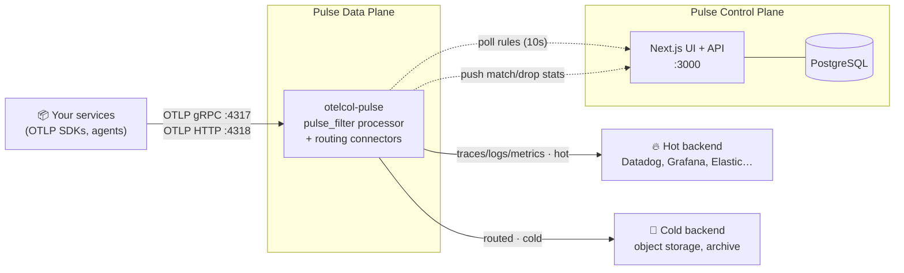

# Pulse

**The open-source observability control plane. Shape, route, and redact telemetry data at the edge — before it hits your backend.**

[](https://github.com/PRIYAM232/pulse-telemetry/actions/workflows/ci.yaml)
[](https://opentelemetry.io/docs/collector/)
[](data-plane/)
[](control-plane/)
[](LICENSE)

Modern observability has a cost problem. Teams ship every log line, span, and metric to their vendor, then pay per-GB to store data that is 90% noise — health checks, debug chatter, duplicate stack traces — while PII quietly leaks into third-party backends. Tuning any of it means editing collector YAML and rolling restarts across the fleet.

Pulse fixes this at the edge. It's a smart OpenTelemetry firewall that sits between your applications and your observability backend: define policies in a web UI, and every collector in your fleet picks them up **within seconds, with zero restarts and zero code changes**. **DROP** the noise, **SAMPLE** the bulk, **REDACT** the PII, **ROUTE** low-value data to cheap storage, and **THROTTLE** noisy tenants before they take down your pipeline.

- 💸 **Cut observability spend** — filter and sample at the source, not the invoice.
- 🔒 **Enforce compliance** — mask SSNs, credit cards, and tokens before they leave your network.
- 🛡️ **Protect downstream systems** — per-tenant rate limits stop log floods and noisy neighbors.
- ⚡ **Change rules live** — policies propagate to the data plane in seconds, no redeploys.

---

## Architecture

Pulse uses a deliberately decoupled, split-brain design: a compiled, low-latency **Data Plane** that touches your telemetry, and a web-based **Control Plane** that never does.

- **Control Plane** ([`control-plane/`](control-plane/)) — a Next.js application backed by PostgreSQL (Prisma). This is where you manage collector fleets, author policy rules, and watch live match/drop statistics. It serves versioned rulesets over a poll-and-sync API to any number of collectors.

- **Data Plane** ([`data-plane/`](data-plane/)) — `otelcol-pulse`, a custom OpenTelemetry Collector distribution built with the official OCB toolchain. Its core is the purpose-built `pulse_filter` processor: it polls the Control Plane for rule updates, applies them across traces, logs, and metrics with zero-allocation regex matching and lock-free hot-path counters, and atomically swaps rulesets in memory. If the Control Plane is unreachable, the collector **fails open** on its last-known ruleset — your telemetry keeps flowing.



The planes only meet over two HTTP endpoints (rule sync and stats reporting), authenticated per fleet with an API key. You can run one collector on a laptop or a thousand across clusters — they all follow the same policies.

---

## Core capabilities

Every rule targets a signal (traces, logs, or metrics), matches on attributes or content, and applies one of five actions:

| Action | What it does | Typical use |
|---|---|---|
| **DROP** | Discards matching telemetry outright at the edge. | Health-check spans, `DEBUG` logs from prod, k8s liveness noise. |
| **SAMPLE** | Keeps a configurable fraction (`0`–`1`) of matching telemetry, probabilistically, so aggregate statistics stay representative. | Keep 5% of high-volume, low-value traces instead of 100%. |
| **REDACT** | Masks only the matched substrings via zero-allocation regex — the rest of the payload passes through untouched. | SSNs, credit-card numbers, bearer tokens, emails — scrubbed before data leaves your network. |
| **ROUTE** | Never drops; stamps the matching telemetry's resource with a routing destination that forks it into a different pipeline (e.g. `traces/in` → `traces/hot` or `traces/cold`). | Send audit logs to cheap cold storage while errors go to your hot APM backend. |
| **THROTTLE** | Token-bucket rate limiting (events/sec), isolated per tenant by an attribute key of your choice — one bucket per attribute *value*. | Cap each `tenant.id` at 100 logs/sec so one runaway customer can't flood the pipeline for everyone. |

Malformed rules (e.g. a SAMPLE without a rate) are skipped, not fatal — the data plane always fails open rather than blocking telemetry.

---

## Quick start — 5 minutes to value

**Prerequisites:** Docker and Docker Compose. That's it.

### 1. Clone and run the stack

```bash
git clone https://github.com/PRIYAM232/pulse-telemetry.git
cd pulse-telemetry
docker compose -f deploy/docker/docker-compose.yaml up -d --build
```

This brings up the full stack in dependency order: PostgreSQL → a one-shot migrate + seed job → the Control Plane → the `otelcol-pulse` collector. The seed provisions a deterministic **local dev fleet** whose credentials are pre-wired into the collector config (rotate these for any real deployment).

| Service | Port | Purpose |
|---|---|---|
| Control Plane UI + API | `:3000` | Dashboard, policy editor, sync/stats APIs |
| Collector — OTLP gRPC | `:4317` | Telemetry ingest |
| Collector — OTLP HTTP | `:4318` | Telemetry ingest |
| PostgreSQL | `:5432` | Policy + stats storage |

### 2. Open the dashboard

Head to **[http://localhost:3000](http://localhost:3000)** — you'll see the seeded dev fleet, ready for rules.

### 3. Send some telemetry

Use `telemetrygen` (the OTel Collector's load generator) to fire traces at Pulse:

```bash
docker run --rm --add-host=host.docker.internal:host-gateway \
  ghcr.io/open-telemetry/opentelemetry-collector-contrib/telemetrygen:v0.156.0 \
  traces --otlp-endpoint host.docker.internal:4317 --otlp-insecure --traces 20
```

(Have Go installed? `go run github.com/open-telemetry/opentelemetry-collector-contrib/cmd/telemetrygen@v0.156.0 traces --otlp-insecure --traces 20` works too.)

Watch the spans flow through the collector:

```bash
docker logs -f otelcol-pulse
```

### 4. Create a rule — no restart required

In the dashboard, create a **DROP** rule for the dev fleet (for example: traces where `service.name` matches `telemetrygen`). The collector polls for rule changes every **10 seconds** — send the same `telemetrygen` traffic again and watch the batch counts in the collector logs fall to zero.

### 5. Watch the savings

The collector reports match/drop statistics back to the Control Plane every 10 seconds. The dashboard's telemetry view shows exactly what each rule is catching — that's your cost reduction, live, without touching a single YAML file or restarting a single process.

> **Shipping to a real backend:** the packaged dev pipeline terminates in the `debug` exporter so you can see everything working. To export to Datadog, Grafana Cloud, or any OTLP endpoint, add the exporter to [`data-plane/builder-config.yaml`](data-plane/builder-config.yaml), rebuild with `make build`, and reference it in your collector config's `hot`/`cold` pipelines.

---

## Deploying to Kubernetes

The [`pulse-telemetry` Helm chart](deploy/helm/README.md) packages the same stack for Kubernetes — StatefulSet PostgreSQL, migration Job as a Helm hook, Control Plane and collector Deployments, plus optional self-monitoring:

- Collector self-metrics exposed on `:8888` (`otelcol_*` process and pipeline metrics).
- A gated **ServiceMonitor** for Prometheus Operator scraping.
- A pre-built **Grafana dashboard** for collector health, shipped as a sidecar ConfigMap.

```bash
helm install pulse deploy/helm/pulse-telemetry
```

See the [Helm README](deploy/helm/README.md) for image builds, values, and the self-monitoring gates.

---

## Repository layout

```
pulse-telemetry/
├── data-plane/                       # Go — custom OTel Collector distribution
│   ├── builder-config.yaml           # OCB manifest → compiles otelcol-pulse
│   ├── config/otelcol-dev.yaml       # local dev pipeline (otlp → pulse_filter → routing → debug)
│   └── processors/filterprocessor/   # the pulse_filter processor (standalone Go module)
├── control-plane/                    # Next.js + Prisma + PostgreSQL control plane
├── deploy/
│   ├── docker/                       # docker-compose stack + collector image
│   └── helm/pulse-telemetry/         # Kubernetes Helm chart
├── Makefile                          # ocb / tidy / build / run / clean
└── Architecture.md                   # full split-brain design doc
```

---

## Local development

**Data plane** (requires Go):

```bash
make ocb     # install the OpenTelemetry Collector Builder (pinned v0.156.0)
make tidy    # resolve the processor module's dependencies
make build   # ocb generates + compiles data-plane/dist/otelcol-pulse
make run     # start the collector on :4317 (gRPC) / :4318 (HTTP)
```

**Control plane** (requires Node.js and a running PostgreSQL — `docker compose -f deploy/docker/docker-compose.yaml up -d postgres`):

```bash
cd control-plane
npm install
npx prisma migrate dev && npx prisma generate
npm run dev    # http://localhost:3000
```

**Version rule:** the `ocb` binary and every collector `gomod` entry in [`builder-config.yaml`](data-plane/builder-config.yaml) must come from the same collector release line (currently **v0.156.0** / API modules v1.62.0).

### `pulse_filter` configuration

```yaml
processors:
  pulse_filter:
    sync_endpoint: http://control-plane:3000/api/v1/policies/<fleet-id>
    sync_interval: 10s          # how often to poll for rule changes
    stats_endpoint: http://control-plane:3000/api/v1/telemetry/<fleet-id>/stats
    stats_interval: 10s         # how often to report match/drop stats
    fleet_key: <fleet-api-key>  # per-fleet auth; seeded value is dev-only
    log_span_details: false     # per-span debug logging (dev only)
```

---

## Security Posture & Roadmap

We're open-sourcing Pulse with a deliberately honest security story: what V1 assumes, how to run it safely today with infrastructure you already have, and what ships next.

### Designed for trusted environments (the reality)

Pulse V1 assumes deployment inside a **trusted network perimeter** — your private VPC, internal network, or Kubernetes cluster. The Control Plane does not yet ship built-in user authentication, and collector-to-control-plane traffic is authenticated with per-fleet API keys over plain HTTP. Neither component should be exposed directly to the public internet as-is. The docker-compose and Helm quick starts seed **deterministic dev fleet credentials** for a friction-free first run — rotate them for anything beyond local evaluation.

### Production deployment recommendations

V1 is designed to slot behind the perimeter controls your platform team already operates:

- **Control Plane access** — front the Next.js UI and policy API with an Identity-Aware Proxy such as [Cloudflare Access](https://www.cloudflare.com/zero-trust/products/access/) or [Tailscale](https://tailscale.com/), or restrict it to your internal VPN. Every rule mutation then carries your organization's existing identity and access policy.
- **Network encryption** — enforce mTLS between `otelcol-pulse` and the Control Plane with a Kubernetes service mesh ([Istio](https://istio.io/), [Linkerd](https://linkerd.io/)) or a TLS-terminating ingress controller. The sync and stats endpoints are plain HTTP calls, so mesh sidecars wrap them transparently — no Pulse configuration changes required.

### Inherent security benefits

- **100% self-hosted** — telemetry, policies, and statistics never leave your infrastructure; data sovereignty is structural, not contractual.
- **Zero-disk data plane** — the collector is stateless: rulesets and counters live in memory only, so a compromised or evicted collector node holds no telemetry at rest.
- **PII stops at the edge** — `REDACT` rules mask sensitive data *before* it leaves your network, shrinking the compliance surface of every downstream vendor.
- **CVE-gated supply chain** — CI and release pipelines scan all three container images with [Trivy](https://trivy.dev/) and fail on any `CRITICAL` vulnerability; a vulnerable image never receives a registry tag.

### The enterprise roadmap

Slated for upcoming V1.x releases to make Pulse fully compliant out of the box:

- **RBAC & SSO** — Role-Based Access Control and OIDC/SAML Single Sign-On for the Control Plane.
- **Native mTLS** — cryptographic mutual TLS enforcement between the data plane and control plane, without requiring a mesh.
- **Audit logging** — an immutable trail for every telemetry rule mutation: who changed or dropped which rule, and when.

## Contributing

Contributions are welcome — bug reports, exporter recipes, new rule actions, dashboard improvements. Please open an issue to discuss substantial changes first. See [Architecture.md](Architecture.md) for the design principles (the big one: the data plane must never block or lose telemetry because of a control-plane failure).

## License

Apache License 2.0 — see [LICENSE](LICENSE).
