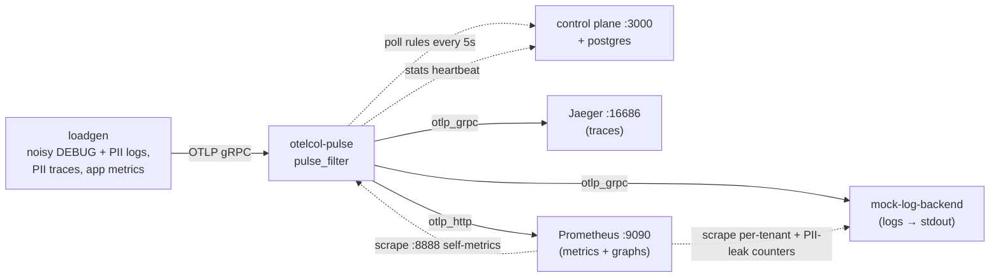

# Pulse sandbox — live REDACT & THROTTLE test

A production-like local rig: the full Pulse stack, real backends on the far side of the proxy, and a synthetic workload that is both noisy and full of PII. You add rules in the dashboard and watch the exported stream change within seconds, with no proxy restart.



| Service | Host port | Role |
|---|---|---|
| `control-plane` | `3000` | Dashboard + policy/stats API |
| `otelcol-pulse` | `4317` / `4318` / `8888` | The proxy under test: OTLP ingest + self-metrics |
| `jaeger` | `16686` | Traces backend (Jaeger v2, the maintained successor to `all-in-one`) |
| `prometheus` | `9090` | Metrics backend (native OTLP receiver) + graphs |
| `mock-log-backend` | — | Log "vendor": prints every record it receives, counts records per tenant and records still carrying PII |
| `loadgen` | — | The workload ([`loadgen/`](loadgen/)) |
| `postgres` | — | Control-plane storage |

Host ports bind `127.0.0.1` only (the control plane has no operator auth). Jaeger doesn't store logs, so logs are verified on the mock backend's stdout and in Prometheus.

### The workload

| Tenant | Service | Stream | Default rate | Exercises |
|---|---|---|---|---|
| `globex` | `search-indexer` | `DEBUG` cache-miss spam, **no PII** | 500 logs/s | THROTTLE |
| `acme`, `initech` | `payments-api` | `INFO` payment logs: email / SSN / card in the body, `user.email` attribute | 5 logs/s each | REDACT (logs) |
| `acme`, `initech` | `payments-api` | checkout traces; PII inside `db.query.text` | 1 trace/s each (3 spans) | REDACT (traces) |
| all | both | `payments.requests`, `search.cache.misses` counters | every 5s | metrics path to Prometheus |

All PII is synthetic and invalid by construction: `example.com/.org/.net` emails, SSNs in the never-issued 9xx area, and the card networks' published test numbers.

---

## 0. Pre-flight: free the ports

```bash
lsof -nP -iTCP -sTCP:LISTEN | grep -E ':(3000|4317|4318|8888|9090|16686) '
```

No output means you're clear. Common collisions are a local `npm run dev` on `:3000` or the packaged stack (`deploy/docker`) on `:4317`. Stop them, or move the sandbox's host ports:

```bash
export PULSE_UI_PORT=3100 OTLP_GRPC_PORT=14317 OTLP_HTTP_PORT=14318
```

The load generator talks to the proxy over the compose network, so moving host ports never changes the test. Adjust the URLs below if you moved them.

## 1. Spin up the stack

From the repo root:

```bash
export COMPOSE_FILE=deploy/sandbox/docker-compose.test.yaml
```

```bash
docker compose up -d --build
```

The first build takes a few minutes, mostly OCB compiling the collector. Startup is ordered: postgres → migrate + seed → control plane (healthy) → backends → proxy → loadgen.

```bash
docker compose ps -a
```

Every service should be `Up`, `control-plane` `(healthy)`, and `control-plane-migrate` `Exited (0)` (it's a one-shot).

Confirm the proxy synced its first ruleset. The 3 seeded TRACES rules target 404s, `/healthz` and `checkout-service`, none of which the load generator emits:

```bash
docker logs pulse-sbx-otelcol 2>&1 | grep 'ruleset updated'
```

Confirm the load generator is sending without errors. Expect `sent logs=5100 (globex=5000 acme=50 initech=50) spans=60 export_errors=0` every 10s:

```bash
docker logs -f pulse-sbx-loadgen
```

Record the proxy's start time. Step 5 proves it never changes:

```bash
docker inspect -f '{{.State.StartedAt}} restarts={{.RestartCount}}' pulse-sbx-otelcol
```

## 2. Watch the raw, noisy, PII-laden stream

**Logs (what the log vendor receives).** The full firehose, about 510 records/s:

```bash
docker logs -f --since 1s pulse-sbx-log-backend 2>&1 | grep --line-buffered 'Body:'
```

Just the PII-bearing records:

```bash
docker logs -f --since 1s pulse-sbx-log-backend 2>&1 | grep --line-buffered -E 'Body:|user.email' | grep --line-buffered -v 'cache miss'
```

```text
Body: Str(kyc verification passed customer=jane.doe@example.com ssn=977-35-7255)
     -> user.email: Str(jane.doe@example.com)
Body: Str(refund issued card=4242-4242-4242-4242 order=ord_e80c63 reason=duplicate_charge)
     -> user.email: Str(jane.doe@example.net)
```

**Traces (Jaeger).** Open **http://localhost:16686**, pick service `payments-api`, click **Find Traces**, open a trace, and expand `SELECT customers` / `INSERT payments`. The `db.query.text` tag contains the raw PII:

```text
SELECT id, name FROM customers WHERE email = 'wei.chen@example.org' AND ssn = '976-07-6318'
INSERT INTO payments (customer_email, card_number, amount) VALUES ('wei.chen@example.org', '6011-1111-1111-1117', 443.00)
```

**Volume and leaks (Prometheus).** One link opens all three graphs:

<http://localhost:9090/query?g0.expr=sum%20by%20(tenant_id)%20(rate(sandbox_backend_logs_total%5B30s%5D))&g0.tab=graph&g0.range_input=15m&g1.expr=sum%20by%20(tenant_id)%20(rate(sandbox_backend_pii_leaks_total%5B30s%5D))&g1.tab=graph&g1.range_input=15m&g2.expr=rate(otelcol_pulse_filter_logs_dropped%5B30s%5D)%20%2F%20rate(otelcol_pulse_filter_logs_received%5B30s%5D)&g2.tab=graph&g2.range_input=15m>

| Panel | Query | Before rules |
|---|---|---|
| Logs/s reaching the backend, per tenant | `sum by (tenant_id) (rate(sandbox_backend_logs_total[30s]))` | globex ≈ 500, acme ≈ 5, initech ≈ 5 |
| PII-bearing logs/s reaching the backend | `sum by (tenant_id) (rate(sandbox_backend_pii_leaks_total[30s]))` | acme ≈ 5, initech ≈ 5 |
| Fraction of logs the proxy drops | `rate(otelcol_pulse_filter_logs_dropped[30s]) / rate(otelcol_pulse_filter_logs_received[30s])` | 0 |

The third panel shows `PromQL info: metric might not be a counter, name does not end in _total/_sum/_count/_bucket`. You can ignore it. Prometheus guesses counters from the metric name alone. The proxy's `otelcol_pulse_filter_*` series are counters, exported without the `_total` suffix on purpose (`without_type_suffix` in `otelcol-sandbox.yaml`) so they keep the classic collector names the Helm chart's Grafana dashboard queries. To confirm the type:

```bash
curl -s localhost:8888/metrics | grep '^# TYPE otelcol_pulse_filter'
```

## 3. Open the Pulse control plane

Open **http://localhost:3000/dashboard**. You should see fleet `local-dev-fleet`, a green **Collector online** badge (stats heartbeat every 10s), and the 3 seeded rules.

## 4. Add the REDACT and THROTTLE rules

Use the **New rule** form once per row. The pattern is also printed at the top of `docker logs pulse-sbx-loadgen`, and `loadgen/pii_test.go` proves it masks everything the generator emits and nothing in the noise.

**PII pattern** (for rules 1 and 3, operator `REGEX_MATCH`):

```text
\b\d{3}-\d{2}-\d{4}\b|\b(?:\d[ -]?){12,15}\d\b|[A-Za-z0-9._%+-]+@[A-Za-z0-9.-]+\.[A-Za-z]{2,}
```

| # | Name | Action | Signal | Condition field | Operator | Value | Extra |
|---|---|---|---|---|---|---|---|
| 1 | `redact-pii-in-log-bodies` | REDACT | LOGS | `log.body` | REGEX_MATCH | *PII pattern* | — |
| 2 | `redact-user-email-attr` | REDACT | LOGS | `user.email` | EXISTS | *(blank)* | — |
| 3 | `redact-pii-in-sql-spans` | REDACT | TRACES | `db.query.text` | REGEX_MATCH | *PII pattern* | — |
| 4 | `throttle-noisy-tenants` | THROTTLE | LOGS | `tenant_id` | EXISTS | *(blank)* | Rate `50`, Group by `tenant_id` |

How these behave:
- **REGEX_MATCH masks only the matches**, writing `[REDACTED_PATTERN]` over each one and keeping the rest of the line. **EXISTS replaces the whole value** with `[REDACTED]`. That's why rules 1 and 2 behave differently.
- `log.body` and `log.severity` are virtual fields on log records. Any other name is an attribute (record first, then resource).
- **Group by `tenant_id`** gives every tenant its own 50/s token bucket, so globex is clamped while acme and initech (5/s each) never touch their limit. Leave it blank and all tenants share one 50/s bucket.
- REDACT applies to LOGS and TRACES; it has no METRICS semantics and is skipped there.

Each save is picked up on the proxy's next policy poll (`sync_interval: 5s`):

```bash
docker logs -f pulse-sbx-otelcol 2>&1 | grep --line-buffered 'ruleset updated'
```

`rules_total` should climb 3 → 7 and `rules_ignored` should stay `0`. In the reference run, the time from clicking **Create rule** to enforcement was about 2.5s.

## 5. Verify the stream changed, without a restart

**PII masked (logs).** Rerun the step 2 command:

```text
Body: Str(kyc verification passed customer=[REDACTED_PATTERN] ssn=[REDACTED_PATTERN])
     -> user.email: Str([REDACTED])
```

The next command should print `0`; before step 4 it printed hundreds:

```bash
docker logs --since 5s pulse-sbx-log-backend 2>&1 | grep -cE '\b[0-9]{3}-[0-9]{2}-[0-9]{4}\b|@example\.'
```

**PII masked (traces).** In Jaeger, run **Find Traces** again and open a new trace:

```text
SELECT id, name FROM customers WHERE email = '[REDACTED_PATTERN]' AND ssn = '[REDACTED_PATTERN]'
INSERT INTO payments (customer_email, card_number, amount) VALUES ('[REDACTED_PATTERN]', '[REDACTED_PATTERN]', 69.72)
```

**Volume dropped.** Reload the Prometheus link. Within about 30s (the `rate()` window):

| Panel | After rules |
|---|---|
| Logs/s per tenant | **globex 500 → 50**; acme and initech unchanged at 5 |
| PII leaks/s | **5 → 0** for both tenants |
| Proxy drop fraction | **0 → 0.88** (≈ 450 of 510 logs/s) |

The load generator still reports `globex=5000` per 10s, which shows the drop happens in the proxy, not at the source. The dashboard's **Telemetry dropped** and **Data reduction** cards climb on the next heartbeat.

**No restart.** The output should be identical to what you recorded in step 1, with `restarts=0`:

```bash
docker inspect -f '{{.State.StartedAt}} restarts={{.RestartCount}}' pulse-sbx-otelcol
```

### Reference run (2026-09-12)

| Check | Before | After |
|---|---|---|
| Backend logs/s — globex / acme / initech | 500 / 5 / 5 | 50 / 5 / 5 |
| Backend PII-bearing logs/s | 10 | 0 |
| Proxy logs received / dropped per s | 510 / 0 | 510 / 450 |
| Exporter send failures, loadgen export errors | 0, 0 | 0, 0 |
| Rule click → enforced | — | ~2.5s |
| Proxy `RestartCount` | 0 | 0 |

## 6. Try the other rule types

Four more rules, each covering a path the step 4 rules don't: DROP on logs, SAMPLE on traces, ROUTE, and a rule on the metrics signal. Add them with the step 4 rules still in place, and keep the `ruleset updated` command from step 4 running.

| # | Name | Action | Signal | Condition field | Operator | Value | Extra |
|---|---|---|---|---|---|---|---|
| 5 | `drop-debug-logs` | DROP | LOGS | `log.severity` | EQUALS | `DEBUG` | — |
| 6 | `sample-initech-traces` | SAMPLE | TRACES | `tenant_id` | EQUALS | `initech` | Sample rate `0.25` |
| 7 | `route-acme-logs-cold` | ROUTE | LOGS | `tenant_id` | EQUALS | `acme` | Route to destination `cold-storage` |
| 8 | `drop-cache-miss-metric` | DROP | METRICS | `metric.name` | EQUALS | `search.cache.misses` | — |

How these behave:
- **Rules run oldest first, on every record.** DROP ends evaluation, THROTTLE spends a token and drops the excess, and REDACT and ROUTE modify the record and continue. So rule 5 drops the 50/s of globex that rule 4 let through.
- **SAMPLE applies to traces only** and decides by trace ID, so a trace is kept or dropped whole. The rate is the fraction kept.
- **ROUTE never drops.** It stamps the record's resource with `pulse.routing.destination`, and the collector's routing connector sends that resource to the matching pipeline. In this sandbox, `cold-storage` is the proxy's own `debug/cold` exporter.
- **A METRICS condition sees `metric.name` and resource attributes**, never datapoint attributes such as `tenant_id`.

`rules_total` should climb 7 → 11, ending at:

```text
"rules_total": 11, "rules_enforced_traces": 5, "rules_enforced_logs": 5, "rules_enforced_metrics": 1, "rules_ignored": 0
```

Wait about 70s before checking. The queries below use 1-minute windows because traces arrive at only 1/s per tenant. Paste them into **http://localhost:9090/query**.

**Rule 5: DEBUG logs dropped.** In the step 2 panels, globex goes **50 → 0** and the drop fraction goes **0.88 → 0.98** (500 of 510 logs/s). This rule leaves acme and initech alone.

**Rule 6: initech traces sampled.** Spans dropped per second should be about **2.25** (3 initech spans/s × 0.75):

```text
sum(rate(otelcol_pulse_filter_spans_dropped[1m]))
```

In Jaeger, search `payments-api` with Tags `tenant_id=initech`. New initech traces appear about a quarter as often as acme's, and each one still has all 3 spans.

**Rule 7: acme logs routed, not dropped.** Count records per tenant reaching the log backend in 5s:

```bash
for t in acme initech globex; do echo "$t=$(docker logs --since 5s pulse-sbx-log-backend 2>&1 | grep -c "tenant_id: Str($t)")"; done
```

Expect `acme=0`, `initech=25`, `globex=0`. acme now lands in cold storage instead:

```bash
docker logs --since 10s pulse-sbx-otelcol 2>&1 | grep 'debug/cold' | tail -3
```

Each line reads `"otelcol.component.id": "debug/cold" … "log records": 1`. The proxy's logs dropped/s stays at exactly 500 (all of globex), because routed records aren't drops.

**Rule 8: one metric dropped.** The proxy drops one metric every 5s, so this should read **0.20**:

```text
sum(rate(otelcol_pulse_filter_metrics_dropped[1m]))
```

`search_cache_misses_total` stops receiving samples, so its age keeps growing until the series goes stale at 5 minutes and the query returns nothing. `payments_requests_total` keeps updating.

```text
time() - max(timestamp(search_cache_misses_total))
```

### Reference run (2026-09-14)

| Check | Before | After |
|---|---|---|
| Backend logs/s — globex / acme / initech | 50 / 5 / 5 | 0 / 0 / 5 |
| Proxy logs received / dropped per s | 510 / 450 | 510 / 500 |
| Proxy spans received / dropped per s | 6 / 0 | 6 / 2.29 |
| Traces per minute in Jaeger — acme / initech | 60 / 60 | 60 / 15 (45 spans) |
| Proxy metrics received / dropped per s | 0.40 / 0 | 0.40 / 0.20 |
| `search_cache_misses_total` increase over 1m | ~30,000 | none (last sample 75s old) |
| Rules saved → enforced | — | ~4.6s |
| Proxy `RestartCount` | 0 | 0 |

---

## Going further

These assume only the step 4 rules. If you did step 6, pause `drop-debug-logs` first, or globex stays at 0.

- **Pause/resume**: click **Pause** on `throttle-noisy-tenants`. globex returns to 500/s on the next poll, and resuming clamps it again. Buckets restart full on every ruleset change, so expect one short burst.
- **Tenant isolation under pressure**: raise the noisy tenant's rate. globex stays at 50/s at the backend while acme and initech don't move.

  ```bash
  NOISY_RATE=5000 docker compose up -d loadgen
  ```

- **Fail-open**: stop the control plane. The proxy logs `policy sync: request failed, keeping last known-good rules`, and PII stays masked and globex stays throttled. Start it again with `docker compose start control-plane`.

  ```bash
  docker compose stop control-plane
  ```

- **Drive it from the host**: stop the containerized load generator, then run it locally (use `-endpoint localhost:14317` if you moved the ports).

  ```bash
  docker compose stop loadgen
  ```

  ```bash
  cd deploy/sandbox/loadgen && go run . -endpoint localhost:4317
  ```

| Variable | Default | Meaning |
|---|---|---|
| `NOISY_RATE` | `500` | globex DEBUG logs/s |
| `TENANT_RATE` | `5` | PII-laden INFO logs/s per well-behaved tenant |
| `TRACE_RATE` | `1` | checkout traces/s per well-behaved tenant |
| `PULSE_UI_PORT`, `OTLP_GRPC_PORT`, `OTLP_HTTP_PORT`, `PROXY_METRICS_PORT`, `JAEGER_UI_PORT`, `PROMETHEUS_PORT` | `3000`, `4317`, `4318`, `8888`, `16686`, `9090` | Host port overrides |

## Teardown

`-v` also wipes Postgres, so your rules and stats are gone and the next `up` starts from the seed:

```bash
docker compose down -v
```

## Troubleshooting

| Symptom | Fix |
|---|---|
| `Bind for 0.0.0.0:4317 failed: port is already allocated` | Another stack owns the port. See step 0. |
| Dashboard says **No heartbeat yet** | The proxy isn't running: `docker logs pulse-sbx-otelcol`. |
| Rule saved but nothing changes | Check the `ruleset updated` line. `rules_ignored > 0` means a rule can't be enforced (e.g. REDACT on METRICS, or SAMPLE on LOGS). A regex Go's RE2 rejects (lookarounds, backreferences) logs `REGEX_MATCH pattern does not compile` and fails open. |
| ROUTE rule enforced but the data still reaches the backend | The destination must exactly match a value in the collector's routing tables. This sandbox only wires `cold-storage` (the `routing/*` connectors in `otelcol-sandbox.yaml`); any other value falls through to the default hot pipeline. |
| `sandbox_backend_*` graphs empty | The mock backend only exposes a series after its first log arrives. Check `docker logs pulse-sbx-loadgen` for `export_errors`. |
